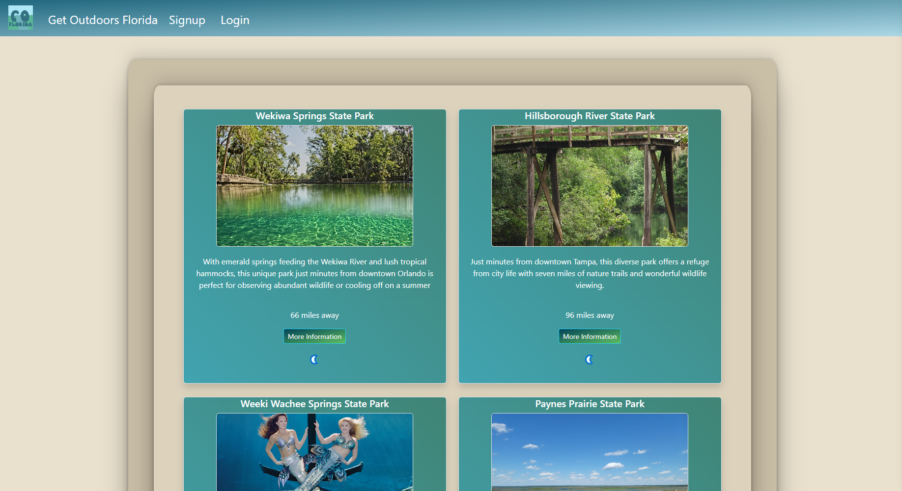

# GetoutdoorsFlorida
  

- [Installation](#installation)

- [Usage](#usage)

- [Contribution](#contributing)

- [License](#license)

## License

A grassroots driven Location aggregator

[Touch Grass!](https://getoutdoorsfla.com)

## Usage

Go on the Website, add some Locations, leave comments, explore!

## Contributing

Feel Free to contribute some locations!

## Questions

Contact me!

Github: https://github.com/yeagermeister

Email: johnyeager75@gmail.com

